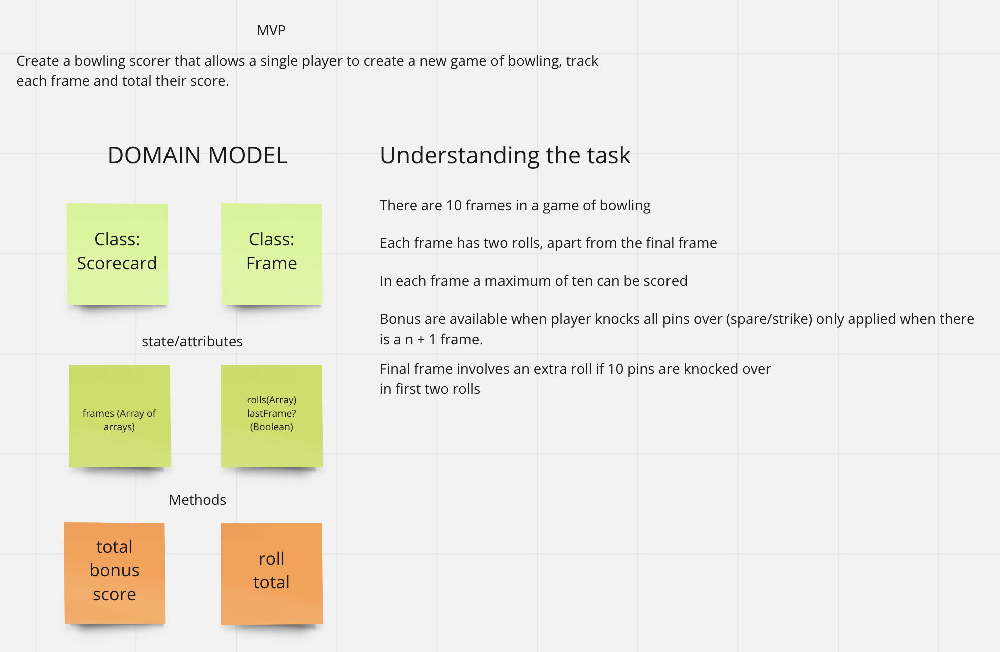
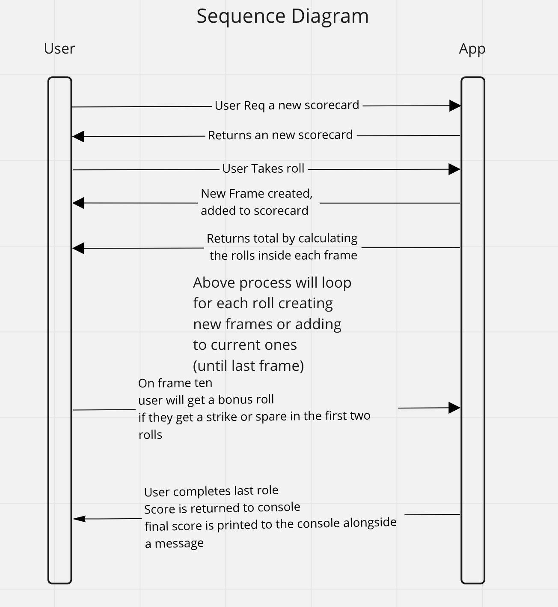

# bowling-scorer
A program that can calculate the score of a game of bowling. 

## Planning 

Below is some diagramming used to conceptulise the problem and create a foundation for building the application. 

### Domain Model and notes

&nbsp;&nbsp;&nbsp;

### Sequence Diagram

&nbsp;&nbsp;&nbsp;

### Features to add 

A UI to interact with the application via command line
Adding edge cases for user trying to take extra rolls or rolls greater than 10. 
